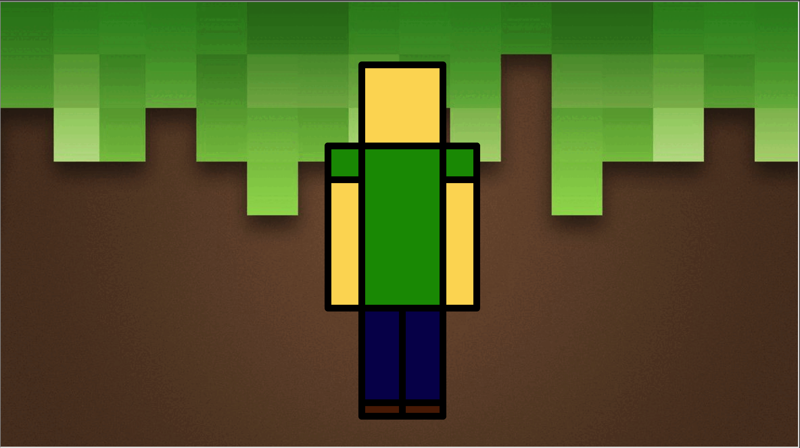

# My Minecraft

## Example




## project structure
```
+-- myminecraft
|    +-- bg.gif
|    +-- main.py
```
<a :href="$withBase('/AdvancedDrawing/my-minecraft/bg.gif')" download>download bg.gif</a>


main.py
```py
from turtle import Turtle, Screen

my_turtle = Turtle()
my_turtle.speed(0)
my_screen = Screen()
my_screen.setup(1191,670)
my_screen.bgpic('bg.gif')

HEAD_BODY_WIDTH = 120
BODY_HEIGHT = 240
LEG_HEIGHT = 160

ARM_WIDTH = 50

SHOE_HEIGHT = 20

HEAD_FILL_COLOR = "#fcd962"
SHIRT_FILL_COLOR = "#139602"
ARE_FILL_COLOR = "#fcd962"
SLEEVE_FILL_COLOR = "#139602"
LEG_FILL_COLOR = "#060359"
SHOE_FILL_COLOR = "#592203"


def head():
    my_turtle.fillcolor(HEAD_FILL_COLOR)
    my_turtle.begin_fill()
    for i in range(4):
        my_turtle.forward(HEAD_BODY_WIDTH)
        my_turtle.left(90)
    my_turtle.end_fill()

def body():
    my_turtle.fillcolor(SHIRT_FILL_COLOR)
    my_turtle.begin_fill()
    for i in range(2):
        my_turtle.forward(HEAD_BODY_WIDTH)
        my_turtle.right(90)
        my_turtle.forward(BODY_HEIGHT)
        my_turtle.right(90)
    my_turtle.end_fill()

def arm():
    my_turtle.fillcolor(ARE_FILL_COLOR)
    my_turtle.begin_fill()
    for i in range(2):
        my_turtle.forward(ARM_WIDTH)
        my_turtle.right(90)
        my_turtle.forward(BODY_HEIGHT)
        my_turtle.right(90) 
    my_turtle.end_fill()

    my_turtle.fillcolor(SLEEVE_FILL_COLOR)
    my_turtle.begin_fill()
    for i in range(4):
        my_turtle.forward(ARM_WIDTH)
        my_turtle.right(90)
    my_turtle.end_fill()


def leg():
    my_turtle.fillcolor(LEG_FILL_COLOR)
    my_turtle.begin_fill()
    for i in range(2):
        my_turtle.forward(HEAD_BODY_WIDTH/2)
        my_turtle.right(90)
        my_turtle.forward(LEG_HEIGHT)
        my_turtle.right(90)
    my_turtle.end_fill()

    my_turtle.penup()
    my_turtle.right(90)
    my_turtle.forward(LEG_HEIGHT-SHOE_HEIGHT)
    my_turtle.left(90)
    my_turtle.pendown()

    my_turtle.fillcolor(SHOE_FILL_COLOR)
    my_turtle.begin_fill()
    for i in range(2):
        my_turtle.forward(HEAD_BODY_WIDTH/2)
        my_turtle.right(90)
        my_turtle.forward(SHOE_HEIGHT)
        my_turtle.right(90)
    my_turtle.end_fill()

    my_turtle.penup()
    my_turtle.left(90)
    my_turtle.forward(LEG_HEIGHT-SHOE_HEIGHT)
    my_turtle.right(90)
    my_turtle.pendown()

def minecraft():
    my_turtle.penup()
    my_turtle.goto(-HEAD_BODY_WIDTH/2,120)
    my_turtle.pendown()
    my_turtle.pensize(10)
    head()
    body()
    my_turtle.backward(ARM_WIDTH)
    arm()
    my_turtle.forward(ARM_WIDTH + HEAD_BODY_WIDTH)
    arm()

    my_turtle.penup()
    my_turtle.right(90)
    my_turtle.forward(BODY_HEIGHT)
    my_turtle.right(90)
    my_turtle.forward(HEAD_BODY_WIDTH)
    my_turtle.right(90)
    my_turtle.right(90)
    my_turtle.pendown()

    leg()
    my_turtle.forward(HEAD_BODY_WIDTH/2)
    leg()
  
  
minecraft()
my_turtle.hideturtle()
my_screen.mainloop()
```