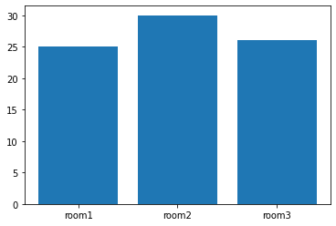

# Basic Graph with Matplotlib

## project structure
```
+-- DS
|    +-- basic-graph.ipynb
```

::: details basic-graph.ipynb
```py
import matplotlib.pyplot as plt
```
```py
X = [1,2,3,4,5,6,7,8,9,10]
Y = [100,50,300,40,50,1,0,9,10,40]

plt.plot(X,Y)
```

```py
plt.scatter(X,Y)
```


```py
rooms = ["room1","room2","room3"]
number = [25,30,26]
plt.bar(rooms,number)
```

```py
data = [-2.94,0.66,1.65,0.15,7.5,-2.94,-0.93,-2.35,-5.49,0.32,0.05,3.81,-0.03,0.61,1.48,0.75,-3.13,-2.42,-4.81,-6.66,1.09,-0.97,-2.75,2.74,-4.54,-2.87,3.24,5.53,4.81,0.82,-1.46,0.88,1.14,-1.34,5.51,0.71,1.05,4.28,0.76,-1.6,-0.23,-6.45,6.67,-2.92,-0.67,-3.55,0.64,0.63,-1.61,5.67]
plt.hist(data)
```


:::