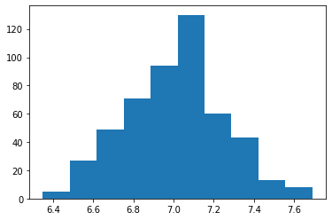
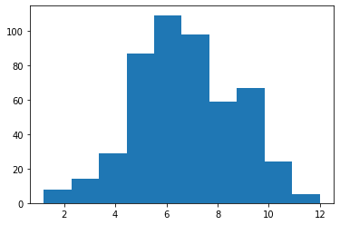

# Data Distribution

## project structure
```
+-- DS
|    +-- basic-graph.ipynb
|    +-- data-distribution.ipynb
|    +-- teacher_score.py
```

teacher_score.py

<a href="/DS/src/teacher_score.py">Download teacher_score.py</a>

```py
teacher_1 = [ ... ]
teacher_2 = [ ... ]
```

::: details data-distribution.ipynb
```py
from teacher_score import teacher_1, teacher_2
print(len(teacher_1))
print(len(teacher_2))
```
500

500

```py
mean_teacher_1 = sum(teacher_1)/len(teacher_1)
mean_teacher_2 = sum(teacher_2)/len(teacher_2)
print(mean_teacher_1)
print(mean_teacher_2)
```
7.008219999999996

6.750539999999995

```py
import matplotlib.pyplot as plt
plt.hist(teacher_1)
```


```py
plt.hist(teacher_2)
```

:::