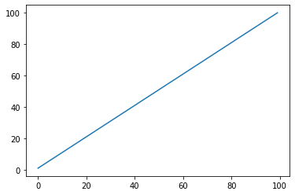
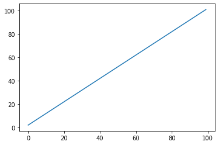
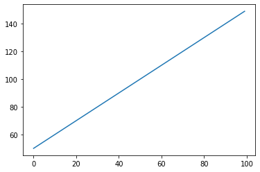
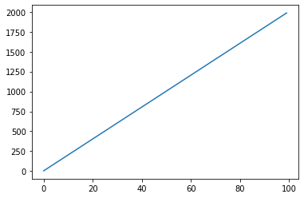
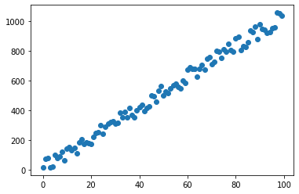
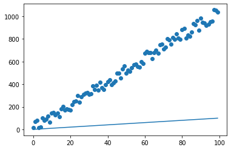
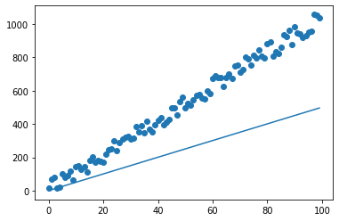

# Linear Regression with Normal Equation

## Linear Equation

$$ y = m \times x + c$$

::: details LR-NE.ipynb

```py
import matplotlib.pyplot as plt

x = list(range(100))


def y_func(x,m,c):
    y = []
    for each_x in x:
        y.append(m*each_x+c) 
    return y

y = y_func(x,1,1)
print(y)
plt.plot(x,y)
```
[1, 2, 3, 4, 5, 6, 7, 8, 9, 10, 11, 12, 13, 14, 15, 16, 17, 18, 19, 20, 21, 22, 23, 24, 25, 26, 27, 28, 29, 30, 31, 32, 33, 34, 35, 36, 37, 38, 39, 40, 41, 42, 43, 44, 45, 46, 47, 48, 49, 50, 51, 52, 53, 54, 55, 56, 57, 58, 59, 60, 61, 62, 63, 64, 65, 66, 67, 68, 69, 70, 71, 72, 73, 74, 75, 76, 77, 78, 79, 80, 81, 82, 83, 84, 85, 86, 87, 88, 89, 90, 91, 92, 93, 94, 95, 96, 97, 98, 99, 100]


```py
y = y_func(x,1,2)
print(y)
plt.plot(x,y)
```
[2, 3, 4, 5, 6, 7, 8, 9, 10, 11, 12, 13, 14, 15, 16, 17, 18, 19, 20, 21, 22, 23, 24, 25, 26, 27, 28, 29, 30, 31, 32, 33, 34, 35, 36, 37, 38, 39, 40, 41, 42, 43, 44, 45, 46, 47, 48, 49, 50, 51, 52, 53, 54, 55, 56, 57, 58, 59, 60, 61, 62, 63, 64, 65, 66, 67, 68, 69, 70, 71, 72, 73, 74, 75, 76, 77, 78, 79, 80, 81, 82, 83, 84, 85, 86, 87, 88, 89, 90, 91, 92, 93, 94, 95, 96, 97, 98, 99, 100, 101]


```py
y = y_func(x,1,50)
print(y)
plt.plot(x,y)
```
[50, 51, 52, 53, 54, 55, 56, 57, 58, 59, 60, 61, 62, 63, 64, 65, 66, 67, 68, 69, 70, 71, 72, 73, 74, 75, 76, 77, 78, 79, 80, 81, 82, 83, 84, 85, 86, 87, 88, 89, 90, 91, 92, 93, 94, 95, 96, 97, 98, 99, 100, 101, 102, 103, 104, 105, 106, 107, 108, 109, 110, 111, 112, 113, 114, 115, 116, 117, 118, 119, 120, 121, 122, 123, 124, 125, 126, 127, 128, 129, 130, 131, 132, 133, 134, 135, 136, 137, 138, 139, 140, 141, 142, 143, 144, 145, 146, 147, 148, 149]



```py
y = y_func(x,20,5)
print(y)
plt.plot(x,y)
```
[5, 25, 45, 65, 85, 105, 125, 145, 165, 185, 205, 225, 245, 265, 285, 305, 325, 345, 365, 385, 405, 425, 445, 465, 485, 505, 525, 545, 565, 585, 605, 625, 645, 665, 685, 705, 725, 745, 765, 785, 805, 825, 845, 865, 885, 905, 925, 945, 965, 985, 1005, 1025, 1045, 1065, 1085, 1105, 1125, 1145, 1165, 1185, 1205, 1225, 1245, 1265, 1285, 1305, 1325, 1345, 1365, 1385, 1405, 1425, 1445, 1465, 1485, 1505, 1525, 1545, 1565, 1585, 1605, 1625, 1645, 1665, 1685, 1705, 1725, 1745, 1765, 1785, 1805, 1825, 1845, 1865, 1885, 1905, 1925, 1945, 1965, 1985]


:::

## Dataset

<a href="/DS/src/codekids_student_dataset.py" download>Click here for download dataset</a>

```py
month = list(range(100))

number_students = [15, 70, 80, 16, 22, 101, 78, 90, 119, ..., 1035]
```

::: details LR-NE.ipynb
```py
from codekids_student_dataset import month, number_students

print(month)
print(number_students)
plt.scatter(month, number_students)
```
[0, 1, 2, 3, 4, 5, 6, 7, 8, 9, 10, 11, 12, 13, 14, 15, 16, 17, 18, 19, 20, 21, 22, 23, 24, 25, 26, 27, 28, 29, 30, 31, 32, 33, 34, 35, 36, 37, 38, 39, 40, 41, 42, 43, 44, 45, 46, 47, 48, 49, 50, 51, 52, 53, 54, 55, 56, 57, 58, 59, 60, 61, 62, 63, 64, 65, 66, 67, 68, 69, 70, 71, 72, 73, 74, 75, 76, 77, 78, 79, 80, 81, 82, 83, 84, 85, 86, 87, 88, 89, 90, 91, 92, 93, 94, 95, 96, 97, 98, 99]

[15, 70, 80, 16, 22, 101, 78, 90, 119, 63, 142, 151, 130, 144, 111, 181, 204, 173, 181, 177, 174, 219, 244, 253, 299, 242, 287, 310, 322, 327, 312, 317, 383, 352, 389, 350, 417, 368, 353, 398, 421, 437, 396, 413, 426, 499, 496, 455, 533, 562, 497, 523, 514, 547, 570, 576, 558, 548, 598, 582, 672, 688, 677, 676, 626, 677, 702, 675, 746, 755, 711, 725, 799, 793, 753, 810, 796, 844, 805, 794, 882, 893, 805, 833, 825, 858, 936, 924, 962, 876, 980, 945, 941, 921, 927, 950, 958, 1056, 1050, 1035]



```py
y_hat = y_func(month,1,1)
plt.scatter(month, number_students)
plt.plot(month,y_hat)
```



```py
y_hat = y_func(month,5,1)
plt.scatter(month, number_students)
plt.plot(month,y_hat)
```




:::

## Normal Equation

$$ \theta = (X^T X)^{-1} \cdot (X^T y)$$


<a href="/DS/src/normal_equation.py" download>Click here for download normal_equation.py</a>

```py
import numpy as np


def solve(x,y):
    
    X = np.array(x).reshape(1,-1)
    y = np.array(y).reshape(-1,1)
    X = np.insert(X,0,np.ones(X.shape),axis=0)
    X = X.T
    c_m = ( np.dot( np.linalg.inv(np.dot(X.T,X)), np.dot(X.T, y) )).tolist()
    print(f"m = {c_m[1][0]}")
    print(f"c = {c_m[0][0]}")
```

::: details LR-NE.ipynb

```py
import normal_equation

normal_equation.solve(month, number_students)
```
m = 10.223534353435346

c = 13.89504950495039

```py
y_hat = y_func(month,10.22,13.89)
plt.scatter(month, number_students)
plt.plot(month,y_hat)
```


:::

## Predict the Future!
- How about 150th month?

```py
print(10.22*150 + 13.89)
```

:::output
1546.89
:::