# Sorting algorithms
- There are many sorting sorting algorithms. For example, [Bubble sort](https://en.wikipedia.org/wiki/Bubble_sort), [Merge sort](https://en.wikipedia.org/wiki/Merge_sort), [Insertion sort](https://en.wikipedia.org/wiki/Insertion_sort), [Quicksort](https://en.wikipedia.org/wiki/Quicksort), etc.

# Bubble sort

## Swapping in Python

```py
a = 30
b = 90
print(a)
print(b)
```
:::output
30
90
:::

```py
a = 30
b = 90
a,b = b,a
print(a)
print(b)
```

:::output
90
30
:::

## Bubble sort algorithm

### Initialize

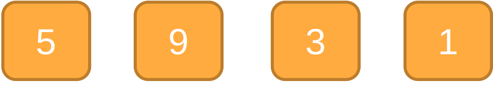


::: details 1st Iteration

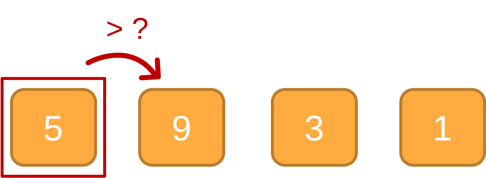

```
if 5 > 9 then Swap
```

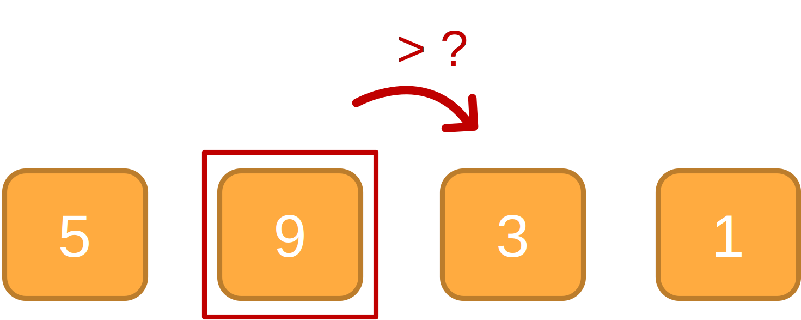

```
if 9 > 3 then Swap
```

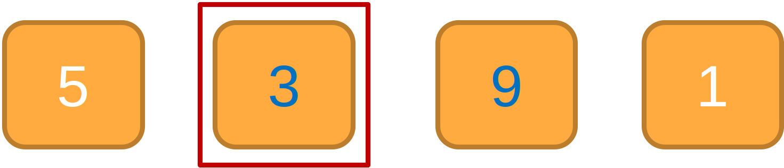

```
Swap
```

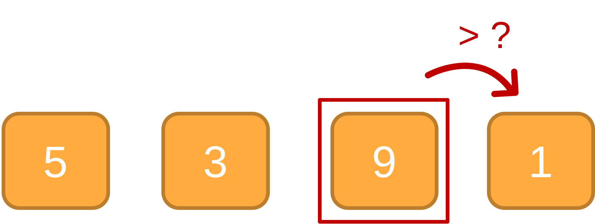

```
if 9 > 1 then Swap
```

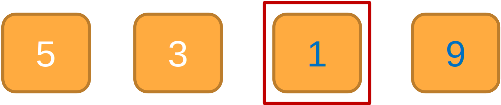
```
Stop
```
:::

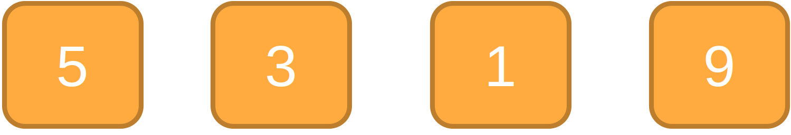

::: details 2nd Iteration

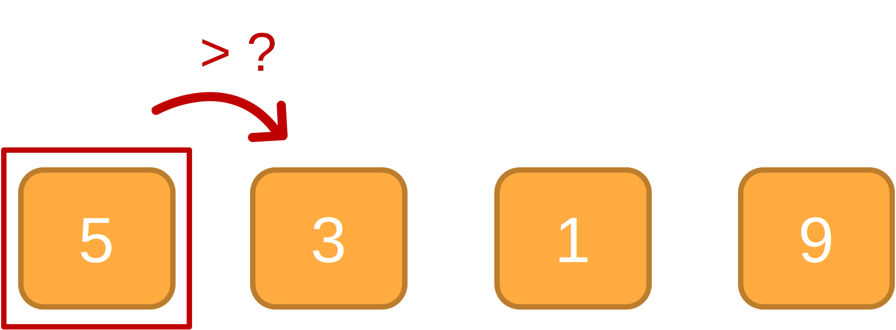
```
if 5 > 3 then Swap
```
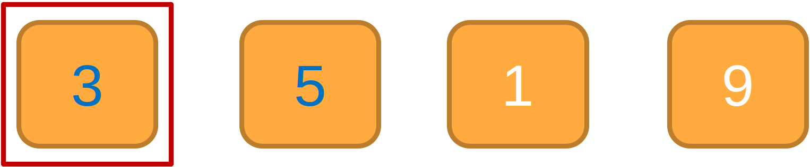
```
Swap
```
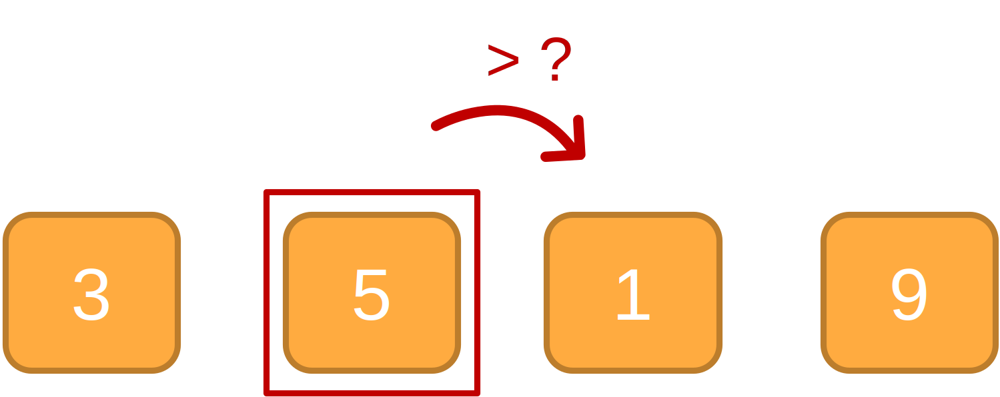

```
if 5 > 1 then Swap
```


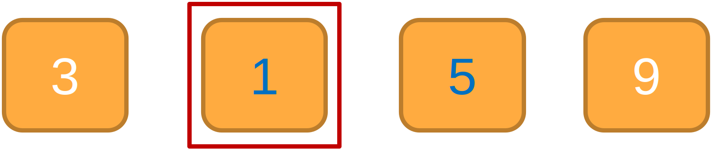
```
Swap
```

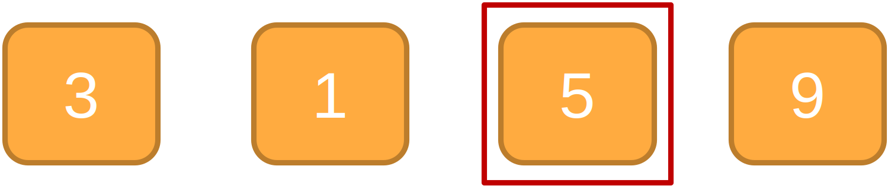
```
Stop
```

:::

```
keep repecting to 4th Iteration
```

### Finalize

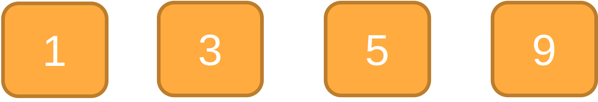

## Python Implementation

```py
arr = [564, 11, 300, 0, -90, 60, 60]

def bubble_sort(arr):
    for i in range(0,len(arr)):
        for j in range(0,len(arr)-1):
            if(arr[j]>arr[j+1]):
                arr[j],arr[j+1] = arr[j+1],arr[j]

bubble_sort(arr)
print(arr)
```

:::output
[-90, 0, 11, 60, 60, 300, 564]
:::