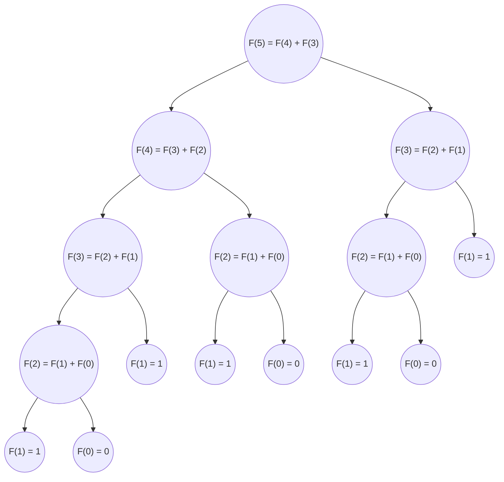

# Divide-and-conquer algorithm: Fibonacci number

## Fibonacci number
```
n   => 0  1  2  3  4  5  6   7   8   9  10  11   12
F_n => 0, 1, 1, 2, 3, 5, 8, 13, 21, 34, 55, 89, 144, ...
```

### General formula

$$ F_0 = 0, F_1 = 1$$

$$ F_n = F_{n-1} + F_{n-2}$$


## Divide-and-conquer

### Iterative case

#### General formula

$$F(N) = F(N-1) + F(N-2)$$

#### Example


$$F(5) = F(4) + F(3)$$




### Base case

$$F(0) = 0,F(1) = 1$$

## Coding

```py
def fibonacci(n):
    if n == 0:
        return 0
    if n == 1:
        return 1
    else:
        return fibonacci(n-1) + fibonacci(n-2)

print(fibonacci(12))
```

:::output
144
:::