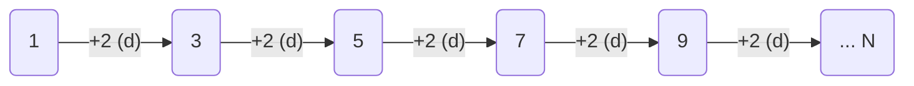

# Arithmetic progression

::: tip
[more information Wikipedia](https://en.wikipedia.org/wiki/Arithmetic_progression)
:::

An arithmetic progression or arithmetic sequence is a sequence of numbers such that the difference between the consecutive terms is constant.

```
1 2 3 4 5 ...
1 3 5 7 9 ...
5 9 13 ...
```


$$a_n = a_1 + (n-1)d$$
$$a_n = a_0 + (n)d$$

In general,

$$a_n = a_m + (n-m)d$$

## Example

```py
numbers = [1, 3, 5, 7, 9]

def an(am, n, d):
	return am + (n*d)


a0 = numbers[0]
d  = 2

print(numbers[0] == an(a0, 0, d))
print(numbers[1] == an(a0, 1, d))
print(numbers[2] == an(a0, 2, d))
print(numbers[3] == an(a0, 3, d))
print(numbers[4] == an(a0, 4, d))
```

$$a_0 = 1, d = 2$$


$$a_n = a_0 + (n)d$$


$$\therefore a_1 = 1 + (1 \times 2) = 3$$
$$\therefore a_2 = 1 + (2 \times 2) = 5$$
$$\therefore a_3 = 1 + (3 \times 2) = 7$$
$$\therefore a_4 = 1 + (4 \times 2) = 9$$

::: output
True
True
True
True
True
:::
