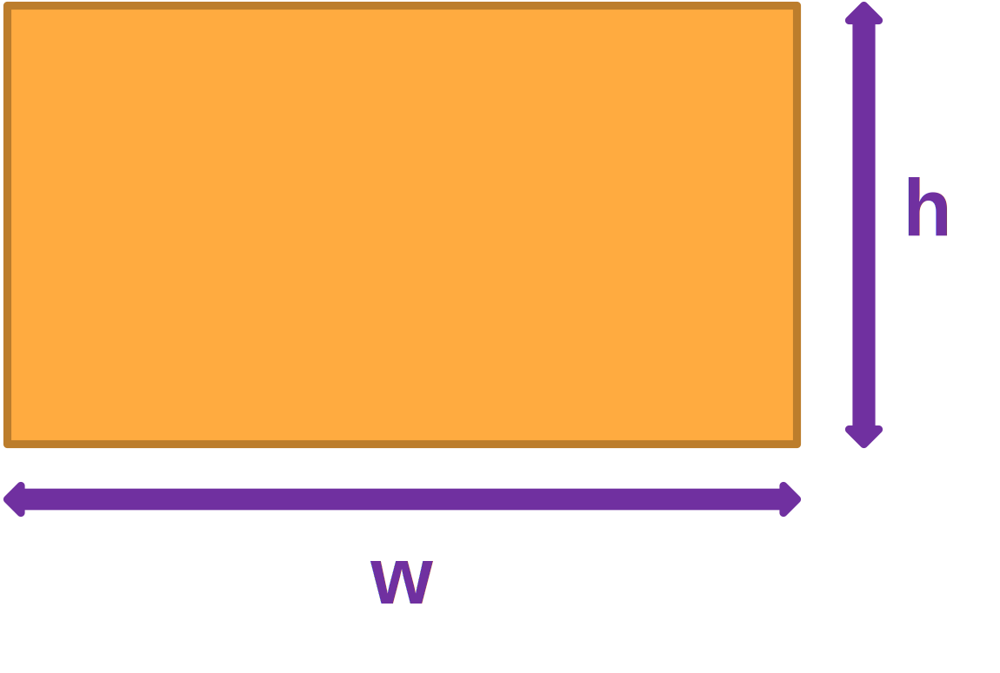
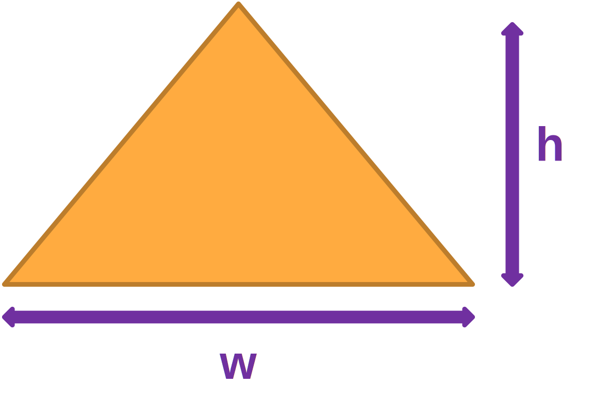

# First Exercises

## Find the area of a rectangle



:::output
w: <span class="pyinput">6</span>
h: <span class="pyinput">9</span>
area of this rectangle: 54.0
:::

::: details Solution
```py
w = float(input("w: "))
h = float(input("h: "))
answer = f"area of this rectangle: {w*h}"
print(answer)
```
:::

## Find the area of a rectangle



:::output
w: <span class="pyinput">6</span>
h: <span class="pyinput">9</span>
area of this rectangle: 27.0
:::

::: details Solution
```py
w = float(input("w: "))
h = float(input("h: "))
print(f"area of this rectangle: {w*h/2}")
```
:::

## Find mean average of 3 values

:::output
a: <span class="pyinput">150</span>
b: <span class="pyinput">20</span>
c: <span class="pyinput">1</span>
57.0
:::

:::output
a: <span class="pyinput">9</span>
b: <span class="pyinput">9</span>
c: <span class="pyinput">0</span>
6.0
:::

::: details Solution
```py
a = float(input("a: "))
b = float(input("b: "))
c = float(input("c: "))
print((a+b+c)/3)
```
:::

## Find discounted price!

:::output
Enter normal price: <span class="pyinput">900</span>
Enter discount: <span class="pyinput">20</span>
Discounted price: 720.0
:::

:::output
Enter normal price: <span class="pyinput">500</span>
Enter discount: <span class="pyinput">40</span>
Discounted price: 300.0
:::

::: details Solution
```py
normal_price=float(input("Enter normal price: "))
discount=float(input("Enter discount: "))

discount_price= normal_price-(discount/100*normal_price)
print(f"Discounted price: {discount_price}")
```
:::