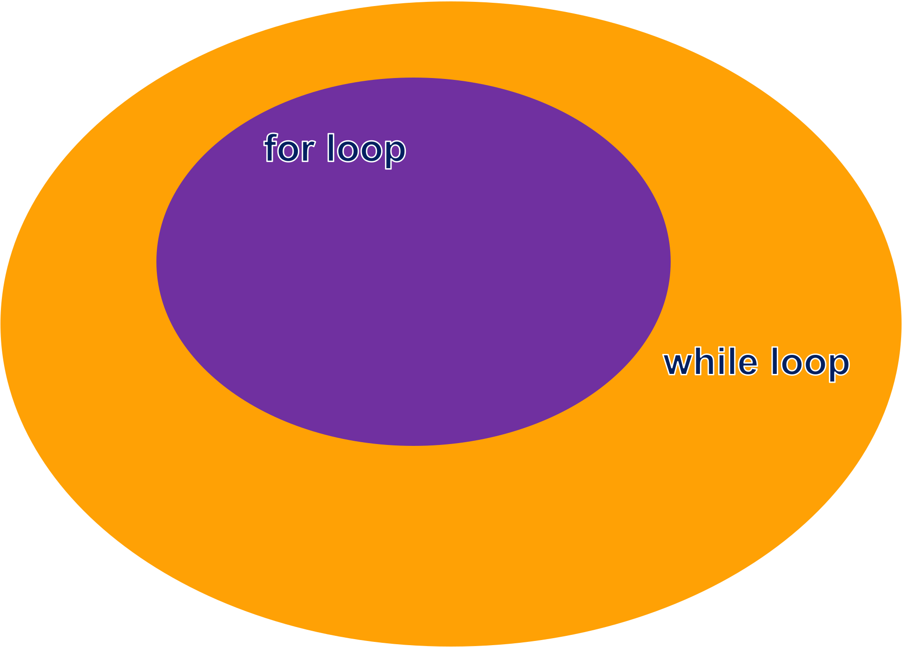

# For Loop

- For Loop is the short form of While Loop.



```py
data = ["Hello", 1, 2, "World"]
for each_data in data:
    print(each_data)
```
:::output
Hello
1
2
World
:::

## Range Object

```range(10)``` == ```range(0,10)``` ~ ```[0, 1, 2, 3, 4, 5, 6, 7, 8, 9]```

```range(5,10)``` ~ ```[5, 6, 7, 8, 9]```

```py
for i in range(10):
    print(i, end=" ")
```
:::output
0 1 2 3 4 5 6 7 8 9 
:::

```py
data = ["Hello", 1, 2, "World"]
for i in range( len(data) ):
    print(data[i]) 
```
:::output
Hello
1
2
World
:::

## Let's start coding together
- Multiplication Table
:::output
n: <span class="pyinput">5</span>
5 X 1 = 5
5 X 2 = 10
5 X 3 = 15
5 X 4 = 20
5 X 5 = 25
5 X 6 = 30
5 X 7 = 35
5 X 8 = 40
5 X 9 = 45
5 X 10 = 50
5 X 11 = 55
5 X 12 = 60
:::

::: details Solution
```py
n=int(input("n: "))
for i in range(1,13):
    print(f"{n} X {i} = {n*i}")
```
:::

## ***Exercise Book*** 12.For Loop