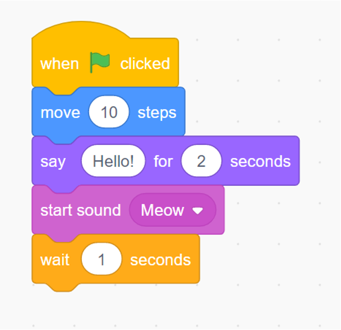
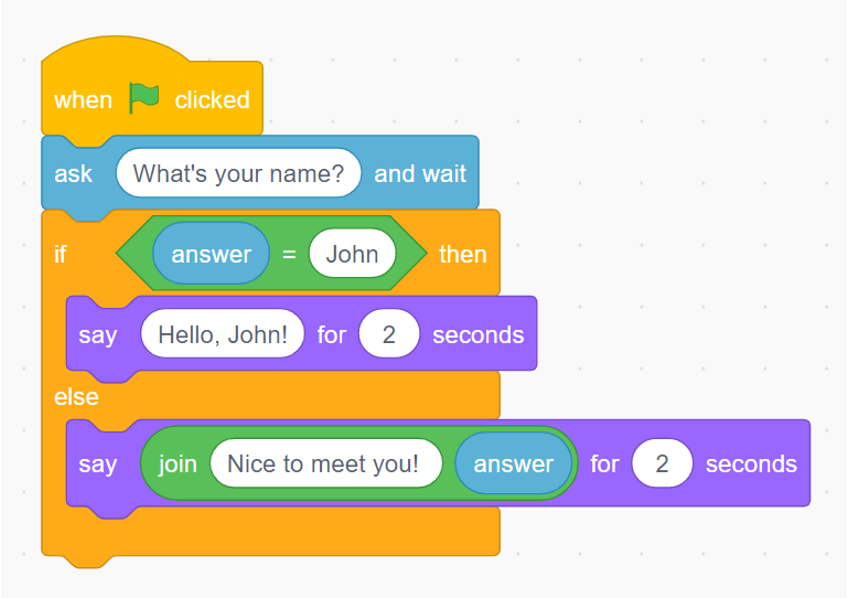
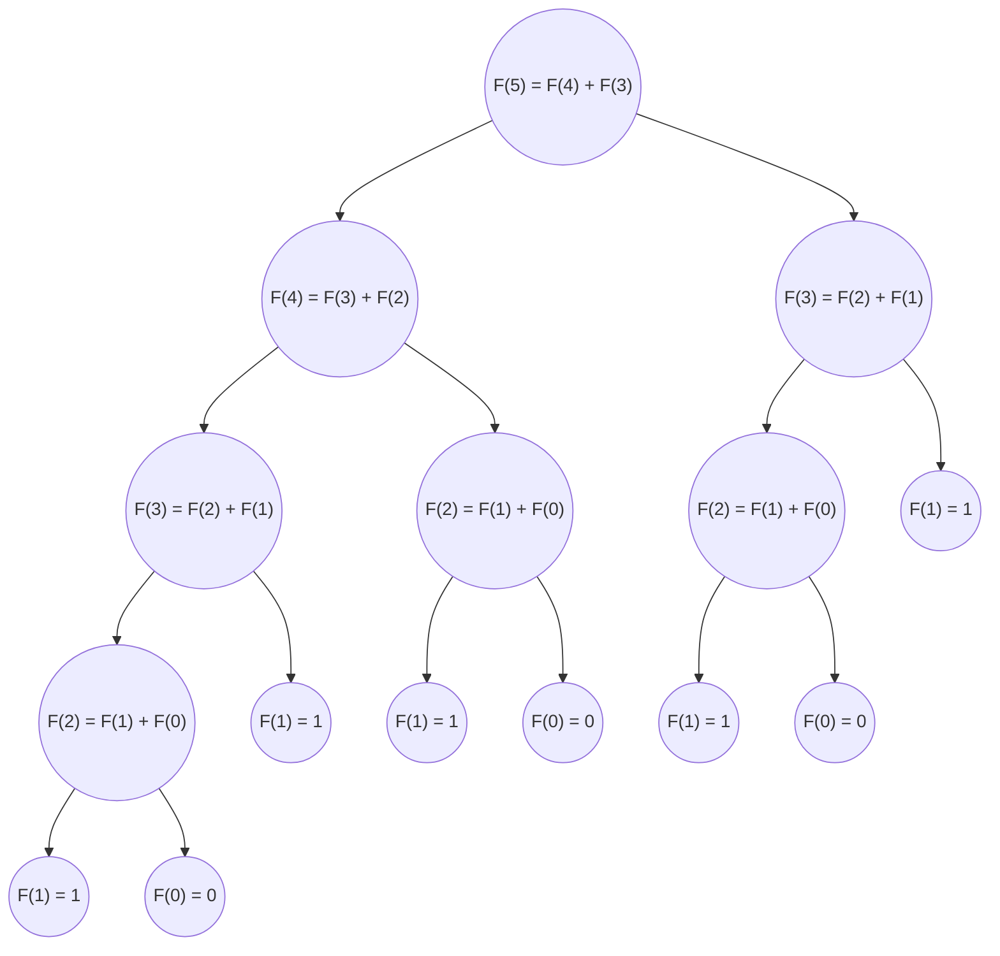
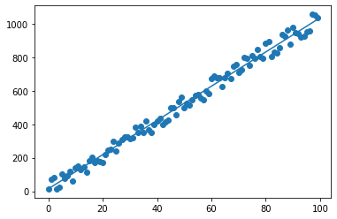

# Introduction

## What is Python? 

[PrePython: Lesson 1 - Introduction](https://prepython.codekids.raknatee.dev/lessons/01/#introduction)

## Control Flow
There are only 3 statements for using in **every algorithm**. On the other hand, it means every program or algorithm is combination of only **3 statements**. 


To emphasize, Only **those statements** can solve any problem in term of creating algorithm in Computer Science.

### Sequence

Sequence is talking about the ordered of the code. The code must be read on the ordered sequencing of successive commands.

For example, Top-to-Bottom, Left-to-Right or Right-to-Left (based on Operator Precedence)



### Condition

Condition is well known as an IF-Else statement which is decided what program should do. The choiced process is controled by the boolean condition that evaluates to be **True** or **False**.




### Iteration

Iteration is also well known as a Loop. Basically, Iteration means we can **repeat** some statements which are related to the Sequence Control Flow. Moreover, Iteration can be controled by the boolean condition.


## What can we do with Python?

### [Drawing and Animation](/#advanced-drawing)


```py
ankur1 = [
        [0, 120],
        ...
        [40, 120],
        [0, 120],
]

ankur2 = [
        [0, -30],
        ...
        [40, -30],
        [0, -30],
]

ankur3 = [
        [0, -220],
        ...
        [60, -220],
        [0, -220],
]
```


```py
...
    while True:
        moon.clear()
        draw_moon(moon, "red", 100, 20)
        draw_moon(crescent, "white", 100, 20)
        move_moon(moon, 0.8)
        screen.update()
...
```

<video controls>
<source :src="$withBase('/AdvancedDrawing/bloody-moon/output.mkv')" type="video/mp4" >
</video>
<hr>

### [Math Solving and Calculation](/#math-problems-data-structures-and-algorithms)





```py
def fibonacci(n):
    if n == 0:
        return 0
    if n == 1:
        return 1
    else:
        return fibonacci(n-1) + fibonacci(n-2)

print(fibonacci(12))
```

### [Microcontroller](/#microcontroller-esp32)

```py
from machine import Pin
from utime import sleep

signal = Pin(26,Pin.OUT)

signal.off()
sleep(1)
signal.on()
sleep(1)
signal.off()
```


### [Data processing](/#junior-data-engineer)

```
Jessie=150
Zak=400
Chester=100
Jim=200
Chester=145
Alexander=200
...
Chester=100
Alexander=260
Zak=400
Chester=150
Jessie=170
```
```py
employees = {}
salary_data = None
with open("salary.txt", "r") as salary_file:
    salary_data = salary_file.readlines()

for each_record in salary_data:
    split_data = each_record.split("=")
    name = split_data[0]
    money = float(split_data[1])
    if name not in employees:
        employees[name] = 0

    employees[name] = employees[name] + money

print(employees)
```

::: output
{'Jessie': 1092.0, 'Zak': 2800.0,
'Chester': 1065.0, 'Jim': 1147.0,
'Alexander': 1670.0, 'Paul': 1025.0}
:::


### [Data Science and Data Analysis](/#junior-data-scientist)




```py
import numpy as np

def solve(x,y):
    X = np.array(x).reshape(1,-1)
    y = np.array(y).reshape(-1,1)
    X = np.insert(X,0,np.ones(X.shape),axis=0)
    X = X.T
    c_m = ( np.dot( np.linalg.inv(np.dot(X.T,X)), np.dot(X.T, y) )).tolist()
    print(f"m = {c_m[1][0]}")
    print(f"c = {c_m[0][0]}")
```

```py
import normal_equation

normal_equation.solve(month, number_students)
```
m = 10.223534353435346

c = 13.89504950495039
```py
print(10.22*150 + 13.89)
```

:::output
1546.89
:::