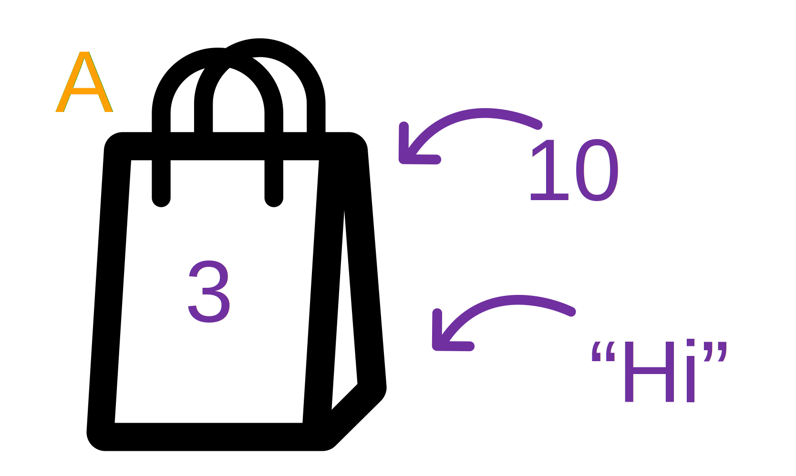
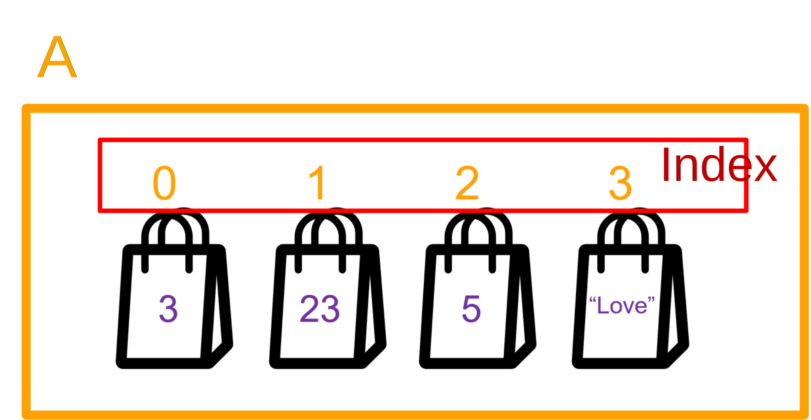

# List and List's method

## Review Variable



- As you might see the variable can contain only one data. However, what if we want to contain more than one?

- not a good example
```py
a0 = 3
a1 = 23
a2 = 5
a3 = "Hello"
```

## Using List



```py
a = [3, 23, 5, "Hello"]
```

### Getting
```py
a = [3, 23, 5, "Hello"]
print(a[0])
print(a[1])
print(a[2])
print(a[3])
print(a[4]) # ??
```

### Setting
```py
a = [3, 23, 5, "Hello"]

a[3] = "HelloWorld"
a[1] = a[0] + a[2]
print(a)
```
::: output
[3, 8, 5, 'HelloWorld']
:::

## List's method

### len
```py
a = [3, 23, 5, "Hello"]

count = len(a)
print(count)
```
::: output
4
:::

### in
```py
a = [3, 23, 5, "Hello"]

bool1 = 23 in a
bool2 = 50 in a
print(bool1)
print(bool2)
```
::: output
True
False
:::

### append
```py
a = [3, 23, 5, "Hello"]
a.append(20)
print(a)
```
::: output
[3, 23, 5, 'Hello', 20]
:::

### del
```py
a = [3, 23, 5, "Hello"]
del a[2]
print(a)
```
::: output
[3, 23, 'Hello']
:::

### remove
```py
a = [3, 23, 5, "Hello"]
a.remove("Hello")
print(a)
```
::: output
[3, 23, 5]
:::

### index

```py
a = [3, 23, 5, "Hello"]
where_is_hello = a.index("Hello")
print(where_is_hello)
```
::: output
3
:::


## Let's start coding together
- To be given score. Then show the grade. (use only array, can't use ```if```)

| Grade | Score |
| --|---|
| A | [80, 100] |
| B | [70, 80) |
| C | [60, 70)
| D | [50, 60)
| F | [0, 50)  

::: output
score: <span class="pyinput">99</span>
get A
:::

::: output
score: <span class="pyinput">50</span>
get D
:::

::: output
score: <span class="pyinput">72</span>
get B
:::

::: output
score: <span class="pyinput">49</span>
get F
:::

::: details Solution
```py
score=float(input("score : "))
i=int(score//10)
g=["F","F","F","F","F","D","C","B","A","A","A"]
print(f"get {g[i]}")
```
:::


