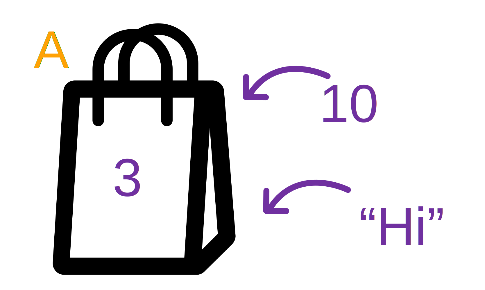

# Variable



- **Variable** looks like a box which you can container one data.

# Type of Variable

## Int (Integer)
3, 4, 5, 100, 99, 0, -5

## Float/Double
3.5, 1.5, 1/2, 31.0

## String
"HelloWorld"

"Hi"

## Boolean
True

False

- **Boolean** can be only **True** or **False**.

## Naming Variable Dos and Don'ts
- Start with a letter
- Symbols and spaces are not allowed (-, /, #, @)
- The underscore can be used (For example, first_name, last_name)

## Assignment Operator (=)

::: tip Very Important!
Assign value of right side to left side.
:::

```py
a = 10
print(a)
```

::: details output
::: output
10
:::


```py
a = 10
print(a)
a = a + 1
print(a)
```
::: details output
::: output
10
11
:::


# Operator
| Syntax      | Description |
| ----------- | ----------- |
| +      | Plus       |
| -   | Minus        |
| * | Multiply |
| / | Divide |
|%| Modulus (หารเอาแต่เศษ) |
| // | Floor Divide (หารไม่เอาเศษ) |
| ** | Exponentiation (ยกกำลัง) |

::: output Example
5%2 == <span class="pyinput">1</span>
9//2 == <span class="pyinput">4</span>
8%3 == <span class="pyinput">2</span>
4**2 == <span class="pyinput">16</span>
:::

## Examples

```py
a = 4
b = 5
print(a+b)

a = "4"
b = "5"
print(a+b)
```

::: details output
:::output
9
45
:::

```py
a = 4
b = "5"
print(a+b)
```

::: details output
:::output
Traceback (most recent call last):
  File "\<string\>", line 3, in \<module\>
<span class="error">TypeError: unsupported operand type(s) for +: 'int' and 'str'</span>
:::
