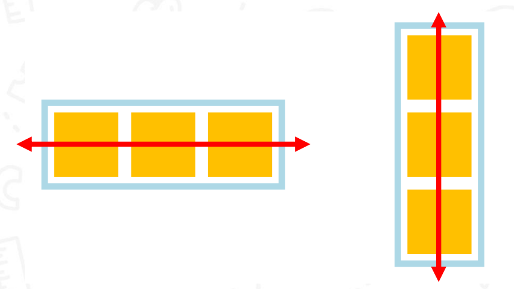
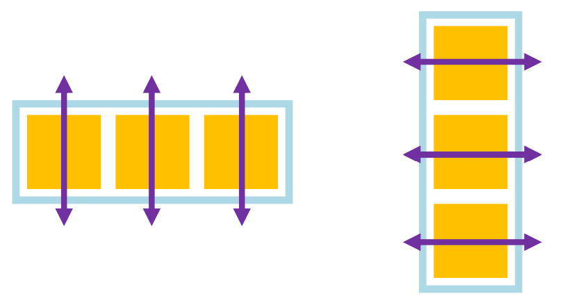

# Flex Layout


```html
...
<div class="layout">
    <div class="box"></div>
    <div class="box"></div>
    <div class="box"></div>
</div>
...
```

```css{5-7}
.layout{
    height: 50vh;
    background-color: gray;

    display: flex;
    flex-direction: column;
    gap: 10px;
}
.box{
    width: 100px;
    height: 100px;
    background-color: yellow;
}
```
<lv01-Flex-Flex flexDirection="column" gap="10px"/>

***
```css{6}
.layout{
    height: 50vh;
    background-color: gray;

    display: flex;
    flex-direction: row;
    gap: 10px;
}
.box{
    width: 100px;
    height: 100px;
    background-color: yellow;
}
```
<lv01-Flex-Flex flexDirection="row" gap="10px"/>

## Spacing


### justify-content 



```css{7}
.layout{
    height: 50vh;
    background-color: gray;

    display: flex;
    flex-direction: row;
    justify-content: space-between;
}
```

<lv01-Flex-Flex flexDirection="row" justifyContent="space-between"/>

```css{7}
.layout{
    height: 50vh;
    background-color: gray;

    display: flex;
    flex-direction: row;
    justify-content: space-around;
}
```

<lv01-Flex-Flex flexDirection="row" justifyContent="space-around"/>

```css{7}
.layout{
    height: 50vh;
    background-color: gray;

    display: flex;
    flex-direction: row;
    justify-content: space-evenly;
}
```

<lv01-Flex-Flex flexDirection="row" justifyContent="space-evenly"/>

```css{7}
.layout{
    height: 50vh;
    background-color: gray;

    display: flex;
    flex-direction: row;
    justify-content: center;
}
```

<lv01-Flex-Flex flexDirection="row" justifyContent="center"/>

```css{8}
.layout{
    height: 50vh;
    background-color: gray;

    display: flex;
    flex-direction: row;
    justify-content: center;
    gap: 10px;
}
```

<lv01-Flex-Flex flexDirection="row" justifyContent="center" gap="10px"/>

### alight-items



```css{7}
.layout{
    height: 50vh;
    background-color: gray;

    display: flex;
    flex-direction: row;
    align-items: flex-start;
}
```

<lv01-Flex-Flex flexDirection="row" alignItems="flex-start"/>

```css{7}
.layout{
    height: 50vh;
    background-color: gray;

    display: flex;
    flex-direction: row;
    align-items: center;
}
```

<lv01-Flex-Flex flexDirection="row" alignItems="center"/>

```css{7}
.layout{
    height: 50vh;
    background-color: gray;

    display: flex;
    flex-direction: row;
    align-items: flex-end;
}
```

<lv01-Flex-Flex flexDirection="row" alignItems="flex-end"/>

## Try it yourself

- display: flex;
- flex-direction: row | column;
- justify-content: space-between | space-around | space-evenly | center;
- align-items: flex-start | center | flex-end;
- gap: {value};

<hr>

<lv01-Flex-Index flexDirection="row" alignItems="flex-end"/>

## Workshops

### [Bar](./07-01.md)

### [Card](./07-02.md)


